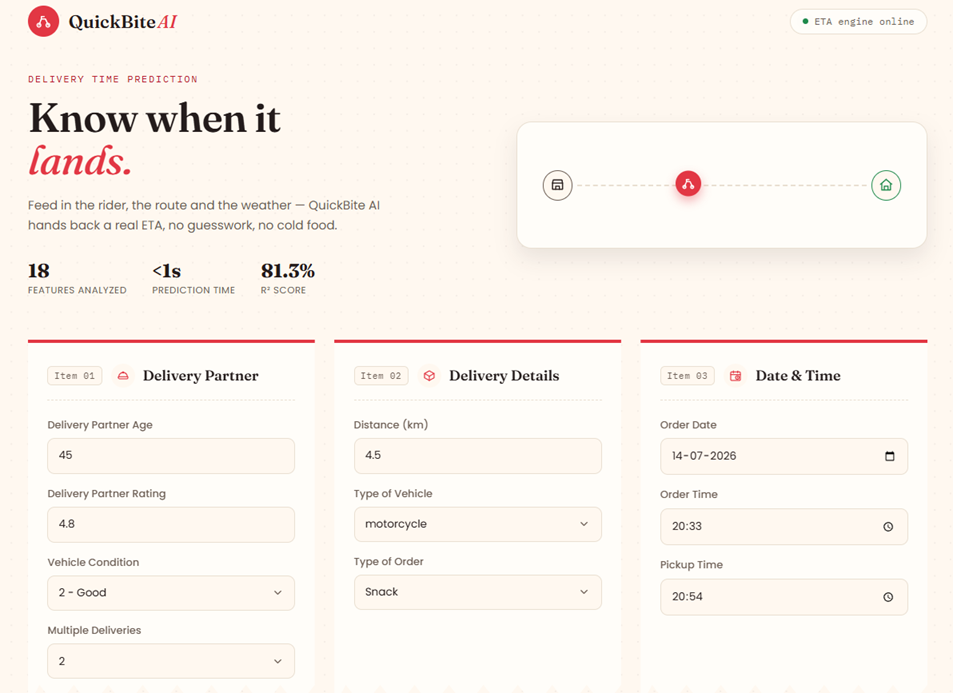
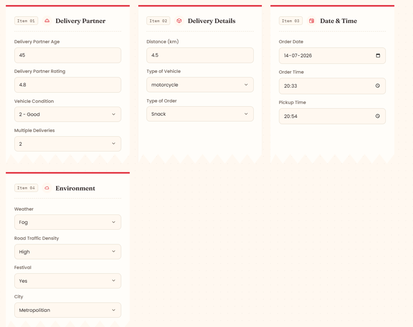
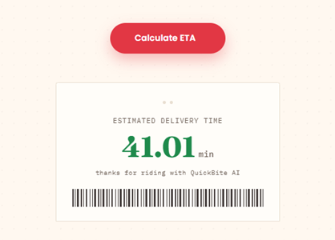

# 🍔 QuickBite AI

### AI Powered Food Delivery Time Prediction using Machine Learning

Predict the estimated food delivery time based on delivery partner details, order information, environmental conditions, and travel distance using a Random Forest Regressor.

---

## 📸 Demo

### Homepage



### Prediction



---

# ✨ Features

- 🚀 Modern Zomato-inspired responsive UI
- 🤖 Machine Learning powered ETA prediction
- 📊 Random Forest Regressor with Hyperparameter Tuning
- 🧠 Intelligent Feature Engineering
- 📍 Distance-based prediction using Haversine Formula
- ⚡ Prediction in under a second
- 🌐 Flask Web Application
- 🎨 Beautiful HTML, CSS & JavaScript frontend

---

# 🧠 Machine Learning Workflow

## Data Cleaning

- Removed invalid delivery partner ratings
- Missing value imputation
- String cleaning
- Whitespace removal
- Handled inconsistent categorical values
- Date & Time preprocessing

---

## Feature Engineering

Instead of directly feeding latitude and longitude into the model, the geographical distance between the restaurant and customer was calculated using the **Haversine Formula**.

This significantly improved the model performance.

Features extracted include:

- Order Hour
- Order Minute
- Pickup Hour
- Pickup Minute
- Order Day
- Order Month
- Day of Week
- Delivery Distance

---

## Data Preprocessing

The preprocessing pipeline includes:

- StandardScaler
- OneHotEncoder
- OrdinalEncoder
- ColumnTransformer

---

## Models Compared

The following regression models were evaluated:

- Linear Regression
- Ridge Regression
- Lasso Regression
- Support Vector Regressor
- KNeighbors Regressor
- Decision Tree Regressor
- Random Forest Regressor

---

## Best Model

🏆 Random Forest Regressor

After hyperparameter tuning using **RandomizedSearchCV**, the Random Forest model achieved the highest performance.

**R² Score:** **81.28%**

---

# 🛠 Tech Stack

### Machine Learning

- Python
- Pandas
- NumPy
- Scikit-learn

### Backend

- Flask

### Frontend

- HTML5
- CSS3
- JavaScript

---

# 📂 Project Structure

```
QuickBite-AI/
│
├── app.py
├── dataset/
├── models/
├── notebook/
├── screenshots/
├── static/
│   ├── style.css
│   └── script.js
├── templates/
│   └── index.html
├── requirements.txt
└── README.md
```

---

# 🚀 Installation

Clone the repository

```bash
git clone https://github.com/yuvraj-singh047/QuickBite-AI.git
```

Move into the project directory

```bash
cd QuickBite-AI
```

Install dependencies

```bash
pip install -r requirements.txt
```

Run Flask

```bash
python app.py
```

Open

```
http://127.0.0.1:5000
```

---

# 📈 Future Improvements

- Google Maps API Integration
- Live Weather API
- Live Traffic API
- Docker Deployment
- Cloud Deployment
- Mobile Responsive Enhancements

---

# 👨‍💻 Author

**Yuvraj Singh**

Computer Science Engineering Student

Made with ❤️ using Machine Learning & Flask.
